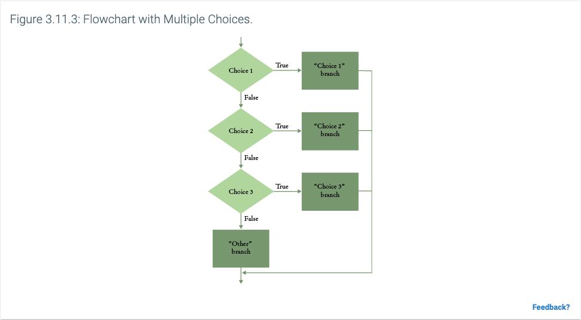

# Fundamentals of Computer Science - Chapter 3

## 3.1 The if Statement
- Essential feature of computer programs is their ability to make decisions based on input or other circumstances
- If statements are like a fork in the road, when a condition in the statement is fulfilled, one set of statements is executed. Otherwise another is executed
- Think of a flowchart with branching behavior
  - 
- These `if/else` branches can include many statements, or they may include no statements
- Some constructs in Python are called compound statements, which have a header and a statement block
  - Headers in compound statements require a colon `:` at the end of the header line
  - Statement block begins on the line following the header, must be indented at the same level as the other statements in the block
- Statement blocks indicate that one or more statements are part of a given compound statement
- Common errors occur with indentations in statement blocks of compound statements
  - Best to save your files with spaces instead of tabs
- Sometimes code can be duplicated in branches of compound statements, in these instances, it is good to move the code outside of the compound statement
### Definitions
- `compound statement`: statement construct that consists of a header and statement block
- `statement block`: a group of one or more statements, all of which are indented at the same indentation level

## 3.2 Special Topic: Conditional Expressions
- Python's conditional operator form `value1 if condition else value2`
  - For example, `actualFloor = floor - 1 if floor > 13 else floor` is equivalent to
    - ```python
      if floor > 13:
          actualFloor = floor - 1
      else:
          actualFloor = floor
      ```
- Conditional expressions must be a single statement on a single line or explicitly continued on the next line

## Relational Operators
- Python has six different relational operators for comparing values
- Relational Operators table
  - 
- Important to remember that `=` does not mean "equal" in Python, it is used for assignment
  - Use `==` for measuring equality
- Strings can be compared using relational operators
- Relational operators have a lower precedence than arithmetic operators, which means the arithmetic operators can be used on either side of the relational operator without parentheses
- Comparing strings with operators like less than or greater than can sometimes yield interesting results
- Typically, you do not want to use `==` operator with floating point numbers
- Floating point numbers do not have infinite precision and calculations introduce roundoff errors
- If you specifically need to do a comparison, you can test that the numbers are "close enough" by using epsilon (Greek letter used to denote very small quantity, typically 1E-14)
```python
from math import sqrt
EPSILON = 1E-14
r = sqrt(2.0)
if abs(r * r - 2.0) < EPSILON:
    print("sqrt(2.0) squared is approximately 2.0")
```
### Definitions
- `relational operator`: an operator that compares two values, yielding a Boolean result

## 3.4 Special Topic: Lexicographic Ordering of Strings
- Python's relational operators compare strings in "lexicographic" order
  - This is similar to how words are sorted in a dictionary
- Slight differences between dictionary ordering and lexicographic ordering
  - All uppercase letters come before the lowercase letters. For example, "Z" comes before "a".
  - The space character comes before all printable characters.
  - Numbers come before letters.
  - Punctuation marks have specific ordering, to be discussed elsewhere

## 3.7 Nested Branches
- Often, you will need to include an `if` statement inside of another if statement, this is called a nested set of statements
- Nesting can go many levels deep, if needed
- Hand-tracing is the technique of simulating the program's activities on a sheet of paper, either with pseudocode or Python code

## 3.9 Multiple Alternatives
- Python has a special `elif` syntax that allows for creating if statements with multiple branches
- As soon as one of the branches is satisfied, no other branch is executed
- If no branch matches, then a final `else` can be used to clean up any of the remaining statements
- Generally, we want to go from the most specific use case to the most generic

## 3.10 Toolbox: Sending E-mail
- MIME - Multi-Purpose Internet Mail Extensions
- SMTP - Simple Mail Transport Protocol

## 3.11 Problem Solving: Flowcharts
- Flowchart shows the structures of decisions and tasks that are required to solve a problem
- When solving a complex problem, a flowchart can be helpful to visualize the overall control flow
  - 
- Task inputs and outputs are linked in the sequence that they are executed
- Decisions can be drawn with diamonds, which have two outcomes
  - 
- Branches can contain sequences of tasks or even more decisions
  - 
- Flowcharts can become unwieldy though if there are too many decisions/branches
- Don't be afraid to "repeat" a particular task in a separate branch of a workflow
- Flowcharts can help provide an intuitive understanding of the flow of an algorithm
- Once flowcharts become large, it is a good idea to switch them to pseudocode

## 3.12 Problem Solving: Test Cases
- To test out an application, it is not feasible to try out every single combination of possible inputs and outputs
- Typically, you want to try one or two test cases from each branch
- Want to aim for complete coverage of all decision points, specifically with an emphasis on testing boundary conditions
  - These are the conditions that are close to, or straddle, different pathways
- Make a list of the test cases and expected outcomes
- Flowcharts can help developing test cases, as you want to design test cases for each path of the flowchart
- Test cases should be designed before starting the actual coding itself
- When developing a schedule, you want to make time for unexpected problems that show up
- Try to develop realistic estimates for the following 
  - Designing program logic
  - Develop test cases
  - Type the program in, fix syntax errors
  - Test and debug the program
- As a rule of thumb, double the time of your estimate, this gives you cushion to protect from embarrassment or failure

## 3.13 Boolean Variables and Operators
- Boolean variables are used to store a condition that can be true or false
  - These data types are named after the mathematician George Boole
- Python `bool` data type has only two values `False` and `True`
  - Example, `failed = True` or `if failed:`
- Booleans can be combined with operators to make complex decisions
  - `and` operator yields `True` only when both conditions are true
  - `or` operator yields `True` if at least one of the conditions is true
- Boolean operators have lower precedence than the expressions on either side of the operator
- `not` operator takes a single condition and inverts the boolean value
- 
- Python treats non-zero values as true
- A common error is to confuse and/or conditions, no golden rule for fixing these, just have to think carefully
- Readability is very important within your programs, and the choice of syntax can impact this
- Should never compare against a literal Boolean in a logic expression
  - For example, do not do `if frozen == False:`, instead do `if not frozen:`
### Definitions
- `boolean operator`: operator that can be applied to boolean values, three examples in Python, `and`, `or`, and `not`

## 3.14 Special Topic: Chaining Relational Operators
- Python allows you to chain relational operators
- For example `value >= 0 and value <= 100` can be rewritten as `0 <= value <= 100`
- However, it is often a good idea to be more explicit, especially when the chains of logic become complex

## 3.15 Special Topic: Short-Circuit Evaluation of Boolean Operators
- `and` and `or` operators are computed using short-circuit evaluation
- This means that the interpreter stops evaluating once the result is assured
- This can be a major time savings if the expressions are very complex 
### Definitions
- `short-circuit evaluation`: evaluating only part of an expression if the remainder cannot change the result

## 3.16 Special Topic: De Morgan's Law
- Generally people have a hard time evaluating logical conditions with `not` applied to `and/or`
- De Morgan's Law can be used to simplify these expressions
- Two forms of De Morgan's Law
  - `not (A and B)` is the same as `not A or not B`
  - `not (A or B)` is the same as `not A and not B`
  - Ex. `not (state == "AK" or state == "HI")` is the same as `state != "AK" and state != "HI"`
- To simplify conditions with negations of and/or expressions, it is usually best to move the negations to the innermost level

## 3.17 Analyzing Strings
- Sometimes necessary to determine if a string contains a substring
- ```python
  name = "John Wayne"
  if "Way" in name:
      print("Found")
  ```
- This makes use of the `in` operator, conversely, you can use the `not in` operator
- Functions exist to check if strings start or end with a particular string
  - Example, `if filename.endswith(".html"):`
- Common substring functions
  - 
- Additional functions can be used to evaluate other conditions
  - For example, `if line.islower():`
  - For example, `if line.isalpha():`
- Common methods for string characteristics
  - 
- Common methods for comparing and analyzing strings
  - 

## 3.18 Application: Input Validation
- When your program accepts user input, you need to make sure that the user-supplied values are valid before using them in the program
- For example, with an elevator program, you cannot have negative numbers
- Simple versions of these validations can be performed with `if` statements

## 3.19 Special Topic: Terminating a Program
- In text based programs, often one will abort the program if the user enters invalid input
- To do this, you can use the `exit()` function in the `sys` package
- ```python
  from sys import exit
  
  if not (userResponse == "n" or userResponse=="y"):
      exit("Error: you must enter either n or y.")
  ```
  
## 3.20 Special Topic: Interactive Graphical Programs
- You can use the `ezgraphics` module to read and validate user input, like other programs
- Additionally, you can use the `getMouse()` function to pause execution until the user clicks
  - This function returns the x,y coordinates of where the user clicked

## 3.21 Computing and Society: Artificial Intelligence
- Serious research into artificial intelligence began in the mid-1950s
- Applications of these systems have been in playing games, translating text, etc.
- Self-driving cars have started to become commercially viable
- Who is responsible for mistakes made by an AI system?

## 3.22 Worked Example: Graphics: Intersecting Circles
- Develop a graphics program that draws two circles, each defined by its center and radius, and determines whether the two circles intersect
- Step 1: Determine the data to be extracted from the user and the appropriate input validation tests
- Step 2: Draw a circle
- Step 3: Determine whether the two circles intersect
- Step 4: Determine where to draw the message in the graphics window
- Step 5: Implement your solution in Python

## 3.23 Toolbox: Plotting Simple Graphs
- Graphs are helpful for representing data and can be displayed using the `matplotlib` library
- 
- Common Pyplot plotting functions
  - 

## 3.24 Chapter Summary
- **Use the `if` statement to implement a decision**
  - The `if` statement allows a program to carry out different actions depending on the nature of the data to be processed
  - Compound statements consist of a header and a statement block
  - Statements in a statement block must be indented to the same level
- **Implement comparisons of numbers and strings**
  - Use relational operators (`< <= > >= == !=`) to compare numbers and strings
  - The relational operators compare strings in lexicographic order
- **Implement decisions whose branches require further decisions**
  - When a decision statement is contained inside the branch of another decision statement, the statements are *nested*
  - Nested decisions are required for problems that have multiple levels of decision making
- **Implement complex decisions that require multiple `if` statements**
  - Multiple `if` statements can be combined to evaluate complex decisions
  - When using multiple `if` statements, test general conditions after more specific conditions
- **Draw flowcharts for visualizing the control flow of a program**
  - Flowcharts are made up of elements for tasks, input/output, and decisions
  - Each branch of a decision can contain tasks and further decisions
  - Never point an arrow inside another branch
- **Design test cases for your programs**
  - Each branch of your program should be covered by a test case
  - It is a good idea to design test cases before implementing a program
- **Use the Boolean data type to store and combine conditions that can be true or false**
  - The Boolean type `bool` has two values, `False` and `True`
  - Python has two Boolean operators that combine conditions: `and` and `or`
  - To invert a condition, use the `not` operator
  - The `and` and `or` operators are computed using short-circuit evaluation: As soon as the truth value is determined, no further conditions are evaluated
  - De Morgan's law tells you how to negate `and` and `or` conditions
- **Examine strings for specific characteristics**
  - Use the `in` operator to test whether a string occurs in another
- **Apply `if` statements to detect whether user input is valid**