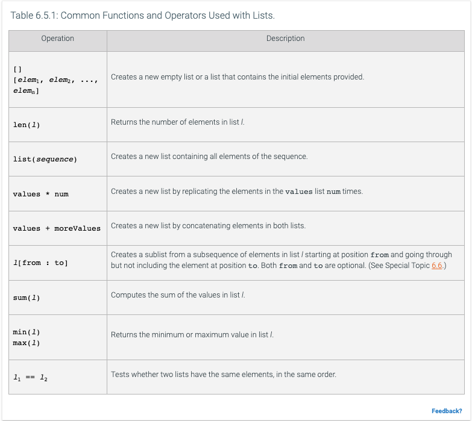
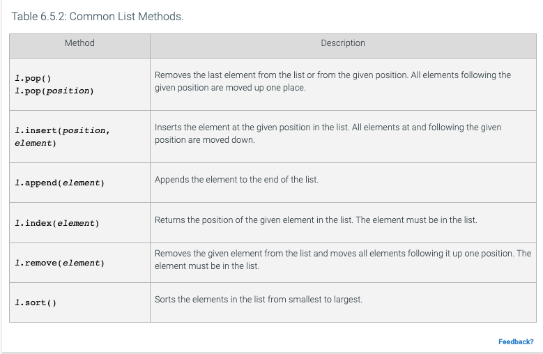

# Fundamentals of Computer Science - Chapter 6

## 6.1 Basic Properties of Lists
- In many applications, need to collect large numbers of values, this can be done in Python using list structures
- Lists are containers that hold a collection of elements in linear or sequential order and can be any size
- syntax for creating a list is to put the values in `[]`
- Each item in a list has an index, which can be access with the subscript operator
  - Assuming `values = [1,2,3]` then `values[0]` will return `1`
  - List indexes start at 0
- This is similar to strings, because both are sequences
- Lists can hold values of any type
- Lists are mutable (they can be modified), unlike strings, which are immutable (cannot be changed)
- Trying to access a list element that does not exist causes an out of range error
- Lists can be traversed by looping over index values or looping over the list itself
- In Python, the variable associated with a list does not store the values themselves, but holds a reference to the list
  - This is important when copying list references
- Use lists to hold common types of related items, generally not a great idea to mix and match different types in a single list
### Definitions
- `list`: a mutable sequence that grows or shrinks dynamically as new elements are added or removed
- `sequence`: a container that stores a collection of values that can be accessed by an integer index
- `out-of-range error`: attempting to access an element whose index is not in the valid index range; bounds error
- `bounds error`: trying to access a sequence element that is outside the legal range
- `reference`: a value that denotes the location of an object in memory. In Python, a variable whose type is a class contains a reference to an object of that class

## 6.2 Special Topic: Negative Subscripts
- Python allows you to use negative subscripts when accessing list elements
- These allow you to access the list in reverse order
- Subscript -1 gives you the last element in the list

## 6.3 Special Topic: Common Container Functions
- The `in` operator can be used to determine if a target is in a particular container
- `min` and `max` functions can be used to get the minimum or maximum elements in a container
- You can use for loops to easily iterate over a list
- Need to be cautious about what types are in your list though, as some functions may not work with certain types

## 6.4 Computing and Society: Computer Viruses
- Computer attacks have become more intensive and more sophisticated in recent years
- Viruses are often focused on stealing sensitive data, such as credit card data or using a machine to perform certain tasks

## 6.5 List Operations
- Python has a wide number of operations that can make processing with lists very convenient
- Appending elements can be done with the `.append()` method
- The `.insert()` method can be used to add a list item at a certain index, adding an element this way moves the items following the new value by one and the list size increases
- Can use the `in` operator to test if an item is in a list
- can use the `.index()` method to find the index of the first match, can also specify a starting position if you want to start at a specific index in the list
  - If the element is not found though, a runtime exception is generated
- Items can be removed by using the `.pop()` method, if you specify an index, all items after that index are moved forward, otherwise the last element is removed
- The `.remove()` method removes an element by value, not position
  - The value must exist or a run-time error is generated
- Lists can be added together using `+` and can be concatenated multiple times using `*`
- Can use `==` to test if lists have the same elements, in the same order, with `!=` being the opposite
- With a list of numbers, you can use `sum()`, `max()`, `min()` functions
- The `.sort()` method can sort a list of numbers or strings in lexicographic order
- If you want to make a copy of a list, use the `list()` function, otherwise you may end up having two variables that reference the same list reference
- 
- 

## 6.7 Common List Algorithms
- Filling can be used to create and fill a list with squares
```python
values = []
for i in range(n):
    values.append(i * i)
```
- Combining list elements (numbers)
```python
result = 0.0
for element in values:
    result = result + element
```
- Combining list elements (strings)
```python
result = ""
for element in values:
    result = result + element
```
- Element Separators
```python
result = ""
for i in range(len(values)):
    if i > 0:
        result = result + ", "
    result = result + values[i]
```
- Linear search to find the position of a value
```python
limit = 100
pos = 0
found = False
while pos < len(values) and not found:
    if values[pos] > limit:
        found = True
    else:
        pos = pos + 1

if found:
    print("Found at position:", pos)
else:
    print("Not found")
```
- Counting and collecting matches
```python
limit = 100
result = []
for element in values:
   if (element > limit):
      result.append(element)
```
- Counting matches without collecting
```python
limit = 100
counter = 0
for element in values:
   if (element > limit):
      counter = counter + 1
```
- Removing matches that meet a particular condition
  - Using a for loop is not appropriate for this type of problem
```python
i = 0
while i < len(words) :
   word = words[i]
   if len(word) < 4 :
      words.pop(i)
   else :
      i = i + 1
```
- Swapping elements
- 
### Definitions
- `linear search`: searching a container (such as an array or list) for an object by inspecting each element in turn