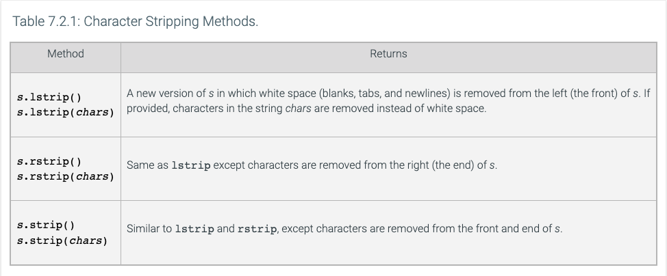
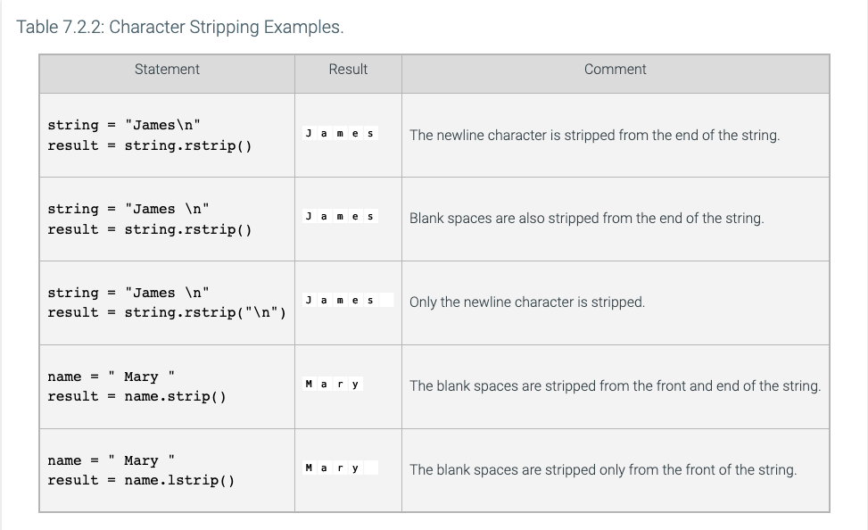
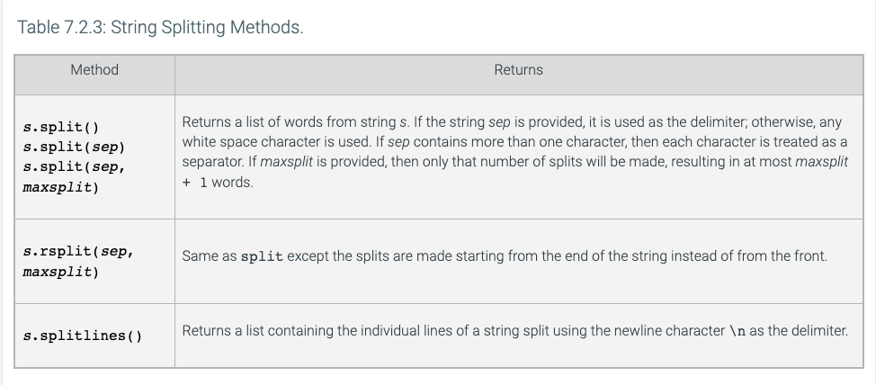
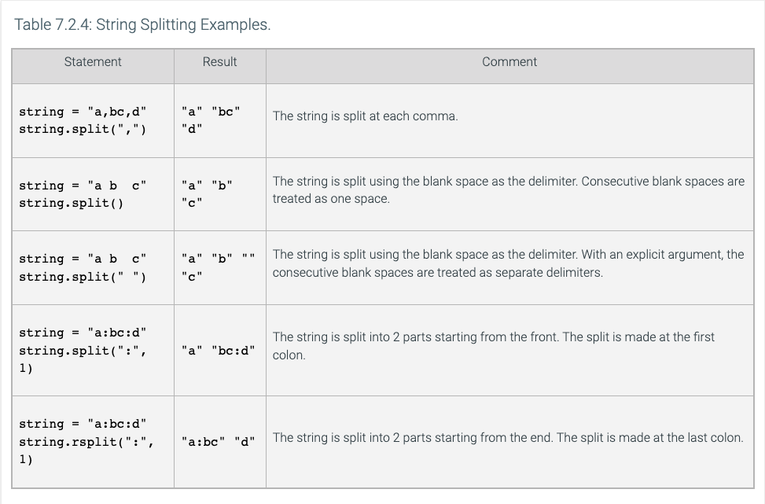
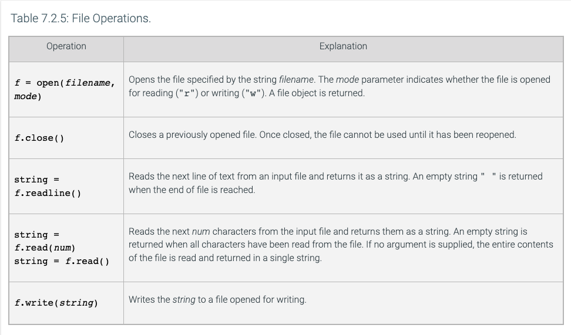

# Fundamentals of Computer Science - Chapter 7

## 7.1 Reading and Writing Text Files
- File processing is extremely important in many programming languages
- A file must be opened before it can be processed, and can be specified whether it is open for reading or writing
```python
# open file for reading
infile = open("input.txt", "r")
```
- This statement returns a file object that is associated with the file `input.txt`
- File object returned by `open()` must be saved to a variable
- To open a file for writing
```python
# open file for writing
outfile = open("output.txt", "w")
```
- If the file already exists, this will overwrite it
- If the file does not exist, an empty file will be created
- When done processing files, make sure to close the file with the `close()` method
```python
infile.close()
outfile.close()
```
- After a file is closed, it will need to be opened again to modify it
- To read from a file, you can use the `readline()` method on the file object to get a single line
  - This will start from the current file position and read until the next newline character
- If file lines are blank, `readline()` will only return a blank line
- If you've opened a file for writing, you can use the `write()` method on the file object
- The write method takes a single string and writes it to the file immediately
- You can print text to a file by using the file parameter of the `print()` function
```python
print("Hello, World!", file=outfile)
```
- A common error that shows up in reading files is the incorrect usage of backslashes
  - To address this, need to use two backslashes in a row
```python
infile = open("c:\\homework\\input.txt", "r")
```
- The single backslash is an escape character
### Definitions
- `escape character`: a character in text that is not taken literally but has a special meaning when combined with the character or characters that follow it. The `\n` character is an escape character in Python strings

## 7.2 Text Input and Output
- Python can treat input files as though they were containers of strings and each line is an individual string
```python
infile = open("file.txt", "r")
for line in infile:
    print(line)
```
- One thing to note is that once a file has been read, you cannot iterate over the file again without closing and reopening the file
- To remove newline characters from strings you can use the `.rstrip()` method
  - This method actually removes all whitespace at the end of a string
  - If you want to remove specific characters at the right of a string, you can pass then to the method
  - For example, `line = line.rstrip(".?")` will remove periods or question marks
- 
- 
- To break up a line into individual words, you can use the `.split()` method on a string
  - By default, this will split the string on each blank space
  - The `.split()` method treats multiple whitespaces as a single delimiter
  - You can pass another character to the `split()` method to split on a different character
  - Note that if you pass a non-default character, multiple instances of that delimiter in a row will be split into multiple outputs
- 
- 
- If you want to read individual numbers of characters, you can use the `.read()` method
  - This can allow you to read a file one character at a time
- 
### Definitions
- `data records`: a collection of data fields pertaining to a common entity

## 7.3 Special Topic: Reading the Entire File
- Two ways to read the entire contents of a file
  - `inputFile.read()` returns a string with all characters in the file
  - `inputFile.readlines()` returns each line of the file into a list
- Be cautious when using this with large files as it may consume large amounts of memory to store the contents as strings

## 7.4 Special Topic: Regular Expressions
- Regular expressions describe character patterns
- Many utilities and editors understand regular expressions (such as grep)
- Python has the module re that contains functions that can accept regular expressions

## 7.5 Special Topic: Character Encodings
- Characters are encoded as sequences of bytes, with each byte being a value between 0 and 255
- Many different encodings exist, but UTF-8 is probably the most popular
  - Each character is encoded as a sequence of one to four bytes
- When reading files, if the encoding is not specified, Python will pick the default encoding from the system
- If you want to specify an encoding when opening a file use the following syntax
```python
infile = open("input.txt", "r", encoding="utf-8")
outfile = open("output.txt", "w", encoding="utf-8")
```
### Definitions
- `character`: a single letter, digit, or symbol

## 7.6 Toolbox: Working with CSV files
- CSVs are simply text files in which each row of a spreadsheet is separated by a new-line, and each column is separated by a comma
- Python provides a csv module to work with these types of files
```python
infile = open("movies1.csv")
from csv import reader
csvReader = reader(infile)
```
- you must open the file first and then read it as a CSV
- Can then loop through rows with a for loop
  - Each row is stored as a list of strings
- To create a csv, you can also use the csv module
```python
outfile = open("newdata.csv", "w")
from csv import writer
csvWriter = writer(outfile)
csvWriter.writerow(["data", "to", "write"])
outfile.close()
```

## 7.7 Command Line Arguments
- There are different ways to start a python program, but one of the most common is to use the command line/terminal
- You can pass the name of the program, the file to run, etc.
- It is customary to interpret strings start with a hyphen as command line parameters
- Command line interfaces make things easier to automate
- Python use the `argv` list in the sys module to receive command line arguments
- The first element of the list `argv[0]` contains the name of the program, while the rest of the list will contain the arguments in the order they were specified
### Definitions
- `command line`: the line the user types to start a program in DOS or UNIX or a command window in Windows. It consists of the program name followed by any necessary arguments

## 7.12 Binary Files and Random Access
- When reading and writing binary files, data items are represented in bytes, which are 8 bits, each bit can be a 0 or a 1
- Binary files are used to save space
- Opening a binary file in a text editor will not allow you to "read" the contents
- To open a binary file for reading or writing, use the following python
```python
infile = open(filename, "rb")
# open for writing
outfile = open(filename, "wb")
```
- with binary files, you don't read text strings, but rather individual bytes
- Reading files one string at a time, without skipping forward or backward is called "sequential access"
- Reading a specific item in a file without having to first read all preceding items is called "random access"
- Each file has a marker that is used to determine where the next string is read or written from, this can be moved to any point in the file
```python
infile.seek(position)
```
### Definitions
- `binary file`: a file in which values are stored in their binary representation and cannot be read as text
- `sequential access`: accessing values one after another without skipping over any of them
- `random access`: the ability to access any value directly without having to read the values preceding it